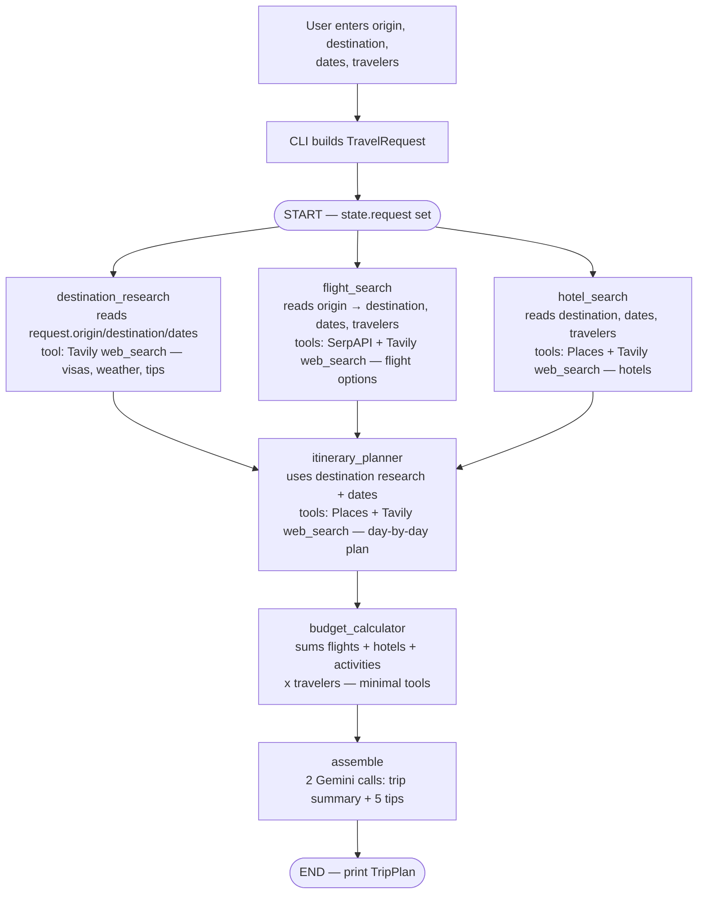

# langchain-travel-planner

Multi-agent travel planner built with **LangChain**, **LangGraph**, and **Gemini**. Five specialist agents research a destination, search flights and hotels, build a day-by-day itinerary, and calculate a budget — orchestrated in parallel by LangGraph. Optional **LangSmith** tracing names every graph node, LLM call, and tool span.

## Setup

Requires Python 3.12+ and [uv](https://docs.astral.sh/uv/).

```bash
uv sync
cp .env.example .env
```

Edit `.env` and set at least:

```
LLM_PROVIDER=gemini
GOOGLE_API_KEY=your_key_here
GEMINI_MODEL=gemini-2.0-flash
```

Optional keys ground agents in live data (without them, Gemini falls back to built-in knowledge):

```
TAVILY_API_KEY=...
GOOGLE_MAPS_API_KEY=...
SERPAPI_API_KEY=...
```

## Usage

Interactive prompts:

```bash
uv run travel-planner
```

Or pass args:

```bash
uv run travel-planner \
  --origin BLR \
  --destination FCO \
  --departure-date 2026-09-10 \
  --return-date 2026-09-17 \
  --travelers 2 \
  --budget 3000 \
  --preferences "food and museums"
```

Progress ticks print as each graph node finishes (parallel agents may complete in any order), then the full trip plan is pretty-printed. A sample run is saved in [examples/sample_run_blr_fco.md](examples/sample_run_blr_fco.md).

## Observability with LangSmith

Every run is fully traced in [LangSmith](https://smith.langchain.com) when these are set in `.env` (also documented in `.env.example`):

```
LANGSMITH_TRACING=true
LANGSMITH_API_KEY=lsv2_...
LANGSMITH_PROJECT=multi-agent-travel-planner
LANGSMITH_ENDPOINT=https://apac.api.smith.langchain.com   # match your workspace region
```

Tracing is automatic for LangChain/LangGraph `ainvoke` and tool calls when `LANGSMITH_TRACING=true`. Helpers in `src/utils/tracing.py` only add run names, tags, metadata, and a post-run deep link. If tracing is off (or the key is bad), the app runs normally without tracing.

Optional: `APP_ENV=dev` (default) is attached as the `env:…` tag.

### What gets traced

Each trip request produces one root run named like:

`trip-plan BLR->FCO @20260713-075812 a1b2c3d4`

(route + UTC timestamp + short run id). The same request’s dates, travelers, budget, preferences, and model are stored as **searchable metadata**. Tags include `travel-planner`, `route:BLR->FCO`, and `env:dev`. Under the root, the trace tree mirrors the graph:

```
trip-plan BLR->FCO @20260713-075812 a1b2c3d4
├── destination_research               ← graph node
│   ├── destination-research:llm-iter-1    ← ReAct iteration (LLM call)
│   ├── destination-research:tool:web_search
│   └── destination-research:llm-iter-2
├── flight_search
│   ├── flight-search:llm-iter-1
│   ├── flight-search:tool:search_flights
│   └── ...
├── hotel_search / itinerary_planner / budget_calculator
└── assemble
    ├── assemble:trip-summary
    └── assemble:travel-tips
```

Every LLM span records the exact prompt, response, token counts, and latency; every tool span records its input args and raw output. After each run the CLI prints a direct link to that trace (or the project name if the deep-link lookup is still catching up).

### How to look into the logs (triage workflow)

1. **Open your project** — smith.langchain.com (or your regional host, e.g. apac.smith.langchain.com) → Tracing Projects → `multi-agent-travel-planner`. Each row is one trip request; the CLI also prints the direct URL after every run.
2. **Find the run you care about** — filter the runs table:
   - by tag: `route:BLR->FCO`, `env:dev`, or `agent:flight-search`
   - by metadata: e.g. `metadata.destination = "FCO"` or `metadata.travelers = 2`
   - by status `error`, or sort by latency / total tokens to find outliers
3. **Drill into the trace tree** — click the run and expand the node that failed or looks slow. Span names tell you exactly where you are: `flight-search:llm-iter-3` is the third ReAct iteration of the flight agent.
4. **Diagnose common failure shapes**:
   - *Bad JSON output* → open the last `*:llm-iter-N` span of that agent and read the raw LLM response the parser choked on.
   - *Tool failure* → `*:tool:*` spans show the exact args sent and the error string returned (Tavily/SerpAPI/Maps errors are returned as strings, so the span succeeds — read its output).
   - *Agent hit max iterations* → you'll see `llm-final-forced` as the last span.
   - *Slow runs* → the waterfall view shows which node dominates latency and whether the parallel fan-out (destination/flights/hotels) actually overlapped.
5. **Compare runs** — select two runs of the same route to diff prompts, outputs, latency, and token cost after a prompt or model change.
6. **Monitor** — the project's Monitoring tab charts error rate, P50/P99 latency, and token spend over time.

## Architecture



| Node                   | Role                              |
| ---------------------- | --------------------------------- |
| `destination_research` | Visa, weather, tips (Tavily)      |
| `flight_search`        | Flight options (SerpAPI + Tavily) |
| `hotel_search`         | Hotels (Google Places + Tavily)   |
| `itinerary_planner`    | Day-by-day plan                   |
| `budget_calculator`    | Cost breakdown                    |
| `assemble`             | Summary + travel tips             |

There is no budget feedback loop: the graph always proceeds from `budget_calculator` → `assemble` → END.

See [plan.md](plan.md) for the full as-built architecture, agent temps / max iterations, and phase checklist.
