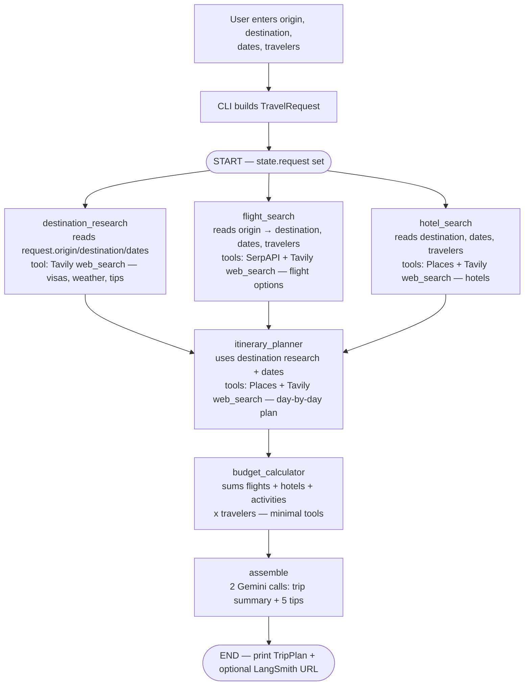
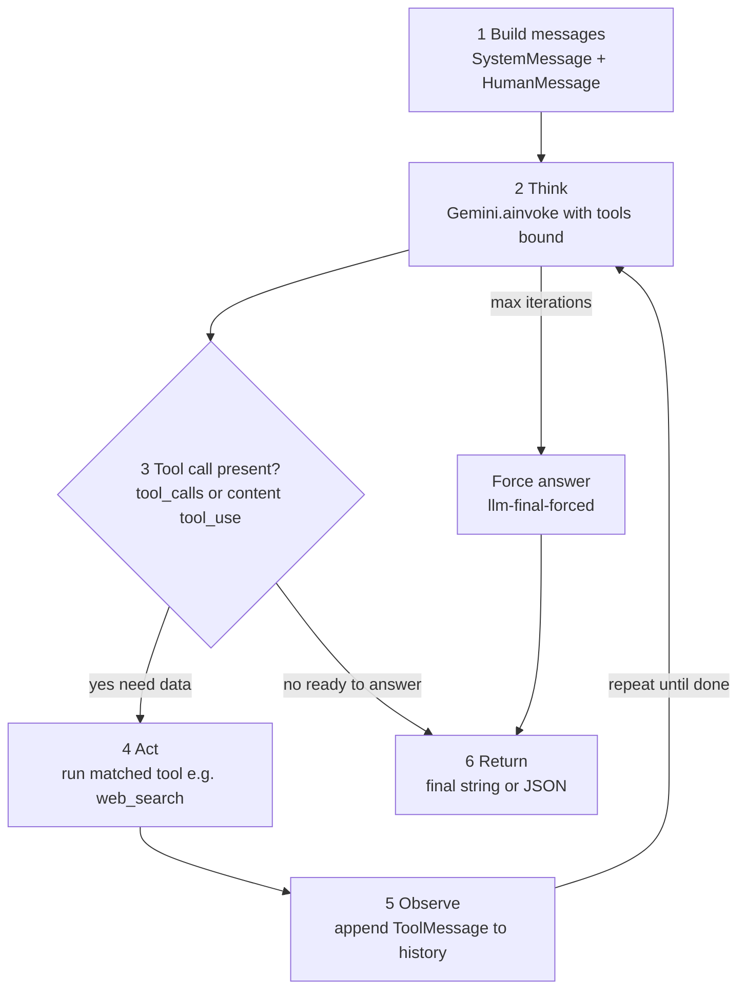
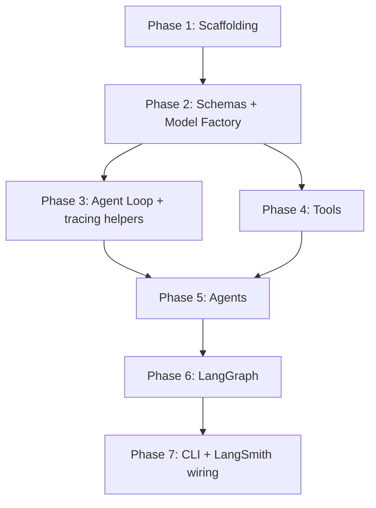

# Python Multi-Agent Travel Planner — As-Built Plan

Port of the [Part 1](https://levelup.gitconnected.com/i-tried-to-plan-a-trip-two-hours-later-i-started-building-an-ai-agent-d0960bfc27b6) and [Part 2](https://levelup.gitconnected.com/my-agents-were-good-running-them-one-at-a-time-was-killing-me-7adab557acad) Medium articles to Python. **All seven phases below are implemented** on this branch.

**Stack:** Python 3.12+, uv, LangChain, LangGraph, LangSmith (optional tracing), Gemini (default `gemini-2.0-flash`, override via `GEMINI_MODEL`), Pydantic, Tavily / Google Maps / SerpAPI (optional, graceful fallback).

---

## Project Structure

```
langchain_travel_planner/
├── pyproject.toml                  # uv project config, dependencies, scripts
├── uv.lock
├── .env.example                    # API key + LangSmith placeholders
├── .gitignore
├── README.md
├── plan.md                         # this file
├── examples/
│   └── sample_run_blr_fco.md       # sample CLI output + LangSmith trace link
└── src/
    ├── config/
    │   └── model_provider.py       # Gemini / OpenAI / Anthropic factory
    ├── models/
    │   └── schemas.py              # TravelRequest, TripPlan, FlightOption, …
    ├── utils/
    │   ├── agent_loop.py           # ReAct loop + Gemini tool-call extraction
    │   ├── json_utils.py           # Safe JSON extraction from LLM output
    │   └── tracing.py              # LangSmith run names, tags, deep links
    ├── tools/
    │   ├── web_search.py           # Tavily web search
    │   ├── google_maps.py          # Google Places search
    │   └── flights.py              # SerpAPI flight search
    ├── agents/
    │   ├── destination_research_agent.py
    │   ├── flight_agent.py
    │   ├── hotel_agent.py
    │   ├── itinerary_agent.py
    │   └── budget_agent.py
    ├── graph/
    │   └── travel_planner_graph.py # LangGraph StateGraph
    └── main.py                     # CLI entry (`uv run travel-planner`)
```

**Notes vs the article:** Python uses `models/` (Pydantic) instead of TypeScript `types/`. Shared `utils/` holds the ReAct loop, JSON helpers, and LangSmith config helpers.

---

## Budget Agent — No Feedback Loop (Matches Article)

The graph is strictly one-directional. `TravelRequest.budget` is context for agents; there is **no** conditional edge that loops back if total exceeds budget.

```
START → [destination, flights, hotels] (parallel)
      → itinerary_planner
      → budget_calculator        ← runs once
      → assemble                 ← always proceeds
      → END
```

A budget-constraint loop would be a future enhancement (`add_conditional_edges`), not built.

---

## Architecture Diagram 1 — End-to-End System Workflow

### What happens when the user submits a trip

User enters (CLI prompts or args): origin, destination, departure/return dates, travelers; optional budget and preferences.

That becomes a `TravelRequest` in LangGraph `TravelState` as `state.request`. Nodes read shared state and write results back. Progress prints via `graph.astream_events(..., version="v2")` as each node finishes. `assemble` produces a `TripPlan` printed to the terminal. With LangSmith enabled, the CLI also prints a deep link to the trace.



**Step-by-step runtime**

1. **CLI** — collect fields → `TravelRequest`; build LangSmith root `config` via `build_root_config`
2. **START** — put request into `TravelState`; graph begins
3. **Wave 1 (parallel)** — three agents run at once, all reading `state.request`:
   - `destination_research` → writes `destination_info`
   - `flight_search` → writes `flights`
   - `hotel_search` → writes `hotels`
4. **Implicit barrier** — `itinerary_planner` only starts after all three finish
5. **Wave 2 (sequential)**
   - `itinerary_planner` → writes `itinerary`
   - `budget_calculator` → writes `budget`
   - `assemble` → writes `final_plan` (`TripPlan`)
6. **END / CLI** — print progress ticks, optional LangSmith URL, then pretty-print the plan

**Node cheat sheet**

| Graph node             | Kind        | What it uses from user input               | Tools / behavior                                    |
| ---------------------- | ----------- | ------------------------------------------ | --------------------------------------------------- |
| `destination_research` | ReAct agent | destination, origin, dates                 | Tavily `web_search`                                 |
| `flight_search`        | ReAct agent | origin, destination, dates, travelers      | SerpAPI `search_flights` + Tavily `web_search`      |
| `hotel_search`         | ReAct agent | destination, dates, travelers              | Google Places `search_places` + Tavily `web_search` |
| `itinerary_planner`    | ReAct agent | dates + research from wave 1               | Google Places `search_places` + Tavily `web_search` |
| `budget_calculator`    | ReAct agent | travelers + flights/hotels/itinerary costs | no tools; math from state                           |
| `assemble`             | not ReAct   | full accumulated state                     | 2 direct Gemini calls → `TripPlan`                  |

**State fields written per node**

| Node                   | Writes to state    | Depends on                         |
| ---------------------- | ------------------ | ---------------------------------- |
| `destination_research` | `destination_info` | `request` only                     |
| `flight_search`        | `flights`          | `request` only                     |
| `hotel_search`         | `hotels`           | `request` only                     |
| `itinerary_planner`    | `itinerary`        | `request` + all 3 parallel outputs |
| `budget_calculator`    | `budget`           | `flights`, `hotels`, `itinerary`   |
| `assemble`             | `final_plan`       | entire accumulated state           |

**Reducer on `errors`:** `Annotated[list[str], operator.add]` — parallel nodes can each append without last-write-wins loss.

**Not separate graph nodes:** implicit barrier, `astream_events` CLI printing, `errors` state field. Future ideas (visa agent, conditional edges, budget feedback loop) are still out of scope.

---

## Architecture Diagram 2 — Single Agent ReAct Loop

Every specialist agent uses `[src/utils/agent_loop.py](src/utils/agent_loop.py)`. `assemble` does **not** — it makes two direct Gemini calls with `agent_config(...)` for LangSmith span names.

**What the loop does**

1. Build chat history: system prompt + human prompt
2. **Think** — `model_with_tools.ainvoke(..., config=agent_config(...))`
3. **Decide** — tool calls present?
   - **Yes** → **Act** (`tool.ainvoke` with named config) → **Observe** (`ToolMessage`) → Think
   - **No** → return final string / JSON
4. If max iterations hit → one forced final LLM call (`llm-final-forced`) → return



**Gemini-specific fix:** `extract_gemini_calls()` checks both `response.tool_calls` and `response.content` parts with `type == "tool_use"`.

**Temperature / max_iter per agent (as built)**

| Agent / call              | Temperature | max_iter |
| ------------------------- | ----------- | -------- |
| `budget_calculator`       | 0           | 2        |
| `flight_search`           | 0           | 6        |
| `hotel_search`            | 0           | 6        |
| `destination_research`    | 0.2         | 5        |
| `itinerary_planner`       | 0.3         | 7        |
| `assemble` summary        | 0.4         | n/a      |
| `assemble` travel tips    | 0           | n/a      |

---

## LangSmith Observability (Implemented)

Tracing is **optional** and env-driven. With `LANGSMITH_TRACING=true` and a valid API key, LangChain auto-instruments every graph node, `ainvoke`, and tool call. Helpers in `[src/utils/tracing.py](src/utils/tracing.py)` only add structure:

| Helper              | Used by                         | Purpose |
| ------------------- | ------------------------------- | ------- |
| `build_root_config` | `src/main.py`                   | Root run name, `run_id`, tags, request metadata |
| `agent_config`      | `agent_loop.py`, `assemble_node`| Per-LLM / per-tool span names (`agent:step`) |
| `get_trace_url`     | `src/main.py` after the run     | Deep link printed to the CLI |
| `tracing_enabled`   | `src/main.py`                   | Gate URL lookup / messaging |

Required env (see `.env.example`):

```
LANGSMITH_TRACING=true
LANGSMITH_API_KEY=lsv2_...
LANGSMITH_PROJECT=multi-agent-travel-planner
LANGSMITH_ENDPOINT=https://apac.api.smith.langchain.com
```

Root run name format (current code): `trip-plan {origin}->{destination} @{UTC-timestamp} {short-run-id}`. Dates, travelers, budget, preferences, and model live in **metadata** (searchable in LangSmith). Tags include `travel-planner`, `route:…`, and `env:{APP_ENV}` (default `dev`).

---

## Flight pricing convention (as built)

`FlightOption.price` on **outbound** options is the **total round-trip fare** for all travelers. **Return** legs use `price=0` and `direction="return"` so the fare is not double-counted. The CLI labels return rows as `(RT fare on outbound)`.

---

## Implementation Phases (Complete)

### Phase 1 — Project Scaffolding ✅

- uv project, Python `>=3.12`, `[project.scripts] travel-planner = "src.main:main"`
- Dependencies include `langsmith` plus LangChain / LangGraph / Gemini / tool SDKs
- `.env.example` covers LLM, tool APIs, and LangSmith

### Phase 2 — Data Contracts and Model Factory ✅

- `[src/models/schemas.py](src/models/schemas.py)` — all Pydantic models (`FlightOption.direction` included)
- `[src/config/model_provider.py](src/config/model_provider.py)` — `create_model(temperature, provider)`

### Phase 3 — ReAct Loop Utility ✅

- `extract_gemini_calls`, `run_agent_loop(..., agent_name=...)`, `message_content_to_text`
- LLM/tool calls pass `config=agent_config(...)` for LangSmith naming
- `[src/utils/json_utils.py](src/utils/json_utils.py)` — `extract_json_array`, structured parse helpers

### Phase 4 — Tools (Graceful Degradation) ✅

| File | Tool | Fallback when key missing |
| ---- | ---- | ------------------------- |
| `web_search.py` | `web_search` | Tavily key message → Gemini knowledge |
| `google_maps.py` | `search_places` | Maps key message → Gemini knowledge |
| `flights.py` | `search_flights` | SerpAPI key message → Gemini knowledge |

### Phase 5 — Five Specialist Agents ✅

| Agent | Tools | Output | Temp | max_iter |
| ----- | ----- | ------ | ---- | -------- |
| destination research | `web_search` | `str` | 0.2 | 5 |
| flight | `search_flights`, `web_search` | `list[FlightOption]` | 0 | 6 |
| hotel | `search_places`, `web_search` | `list[HotelOption]` | 0 | 6 |
| itinerary | `search_places`, `web_search` | `list[DayItinerary]` | 0.3 | 7 |
| budget | none | `BudgetBreakdown` | 0 | 2 |

### Phase 6 — LangGraph Orchestration ✅

- `TravelState` with `errors: Annotated[list[str], operator.add]`
- Six nodes; fan-out then fan-in per Diagram 1
- `assemble_node` — two direct `ainvoke` calls with `agent_config("assemble", ...)`

### Phase 7 — CLI + Observability ✅

- Interactive prompts or argparse flags
- `astream_events` progress ticks
- Non-fatal `errors` printed as warnings
- Pretty-print `TripPlan`
- LangSmith root config + post-run deep link when tracing is on

---

## Dependency Graph (Historical Build Order)



---

## Verification Checklist

Behaviors confirmed against the as-built code / sample run:

- [x] With only `GOOGLE_API_KEY` set, full pipeline runs (agents use Gemini knowledge)
- [x] With all keys set, agents ground answers in live Tavily/SerpAPI/Maps data
- [x] Three parallel agents complete in non-deterministic order in terminal output
- [x] One agent failure does not crash the graph — error appended to `errors`, pipeline continues
- [x] `itinerary_planner` receives full context (destination + flights + hotels)
- [x] Final output is a complete `TripPlan` with summary, structured data, and travel tips
- [x] Optional LangSmith tracing: root run + nested agent/tool spans; CLI prints trace URL when enabled

See [examples/sample_run_blr_fco.md](examples/sample_run_blr_fco.md) for a concrete BLR→FCO run.
